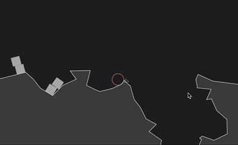

# Peripheral

**Planetary physics-enabled game engine with realtime vector terrain manipulation, made with [Matter.js](https://github.com/liabru/matter-js) and [paper.js](https://github.com/paperjs/paper.js/)**



```bash
yarn install
yarn start
```

Then go to http://localhost:1234

## TODOs

- Convert DTO classes to simple typed objects
- Explosions should "blow away" nearby characters and objects
- Explosion design
- Hitscannig / raycasting
- Try interesting stage design (with ropes / wires)
- Character could maybe be a wall-e esque robot floating with a thruster.